# MSX拡張Cartridge<BR>4Slot Expander Cartridge  

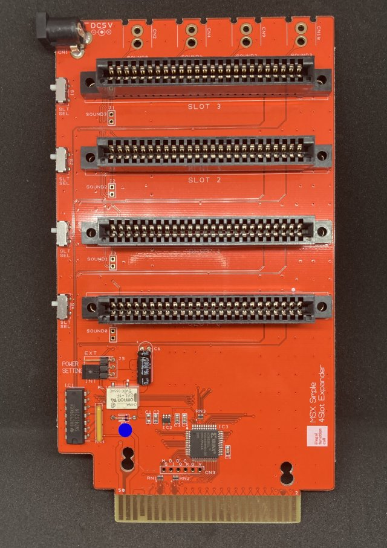  
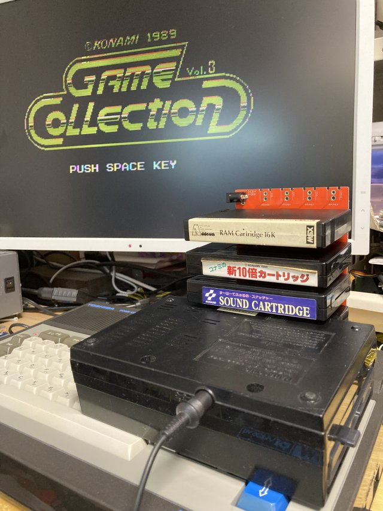  
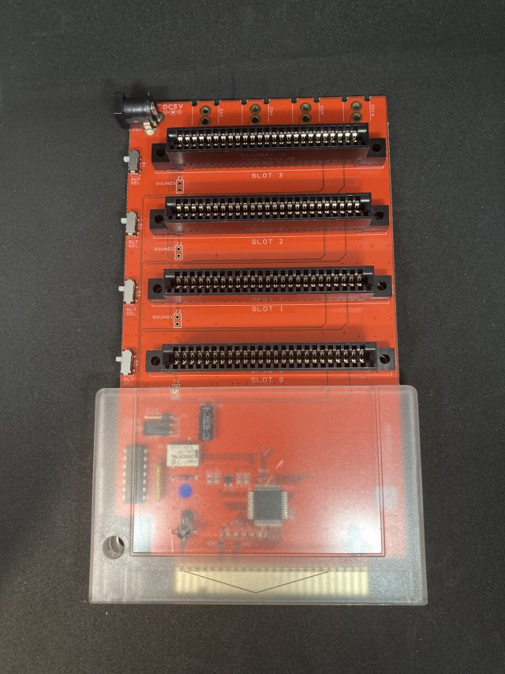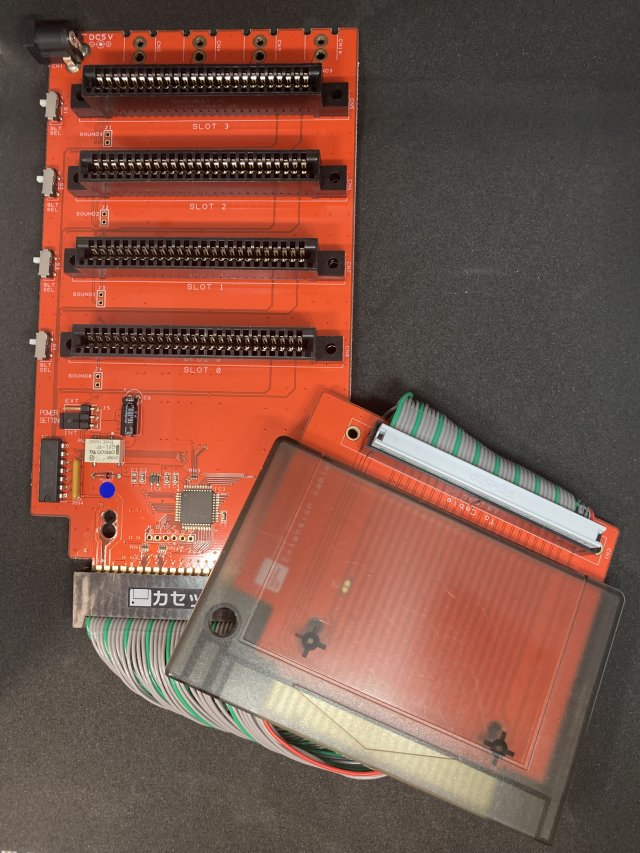

MSX スロットを4つに増やす拡張ユニットです。

MSX規格の拡張スロット仕様に準拠した4スロットユニットです。  
信頼性が必要なカードエッジコネクタは、AMP 5530843-5または5530841-5を使用しています。  

Simple2Slot Expanderのサブセットで、本来の拡張スロットユニットに必要なバスバッファ・電源・音声ミキシング回路を省略することで安価になるように設計しました。  
そのため、個々のスロットは以下のMSX規格を守れていません。  


本基板および各オプションは、家電のKENちゃんおよびBEEPにて頒布を予定しています。    

## ■ 利用上の注意点  

構造上、誰がみても機械的に無理があるので縦差しでの使用はおすすめしません＾＾；  

バスバッファー回路が無い都合上、ファンアウトがMSXスロット規格を満たしていません、  
そのため本体およびカートリッジの組み合わせによる相性が出る場合があります。  


各スロットの電源容量は、本体に依存します。  
電力消費が大きいカートリッジでは動作しない可能性があります。  
規格上は合計で5V 100mAまでです、必要に応じて外部電源モードを使ってください。    
BUSDIR信号には対応しているので、IO系カセットも正常に動作します。

### 動作確認のスロット構成
当方の検証では下記機種、下記構成にて、全スロットへのRead/Writeが確認できています。
```
#X-1 ROM + Memory Mapper 1Mbyte
#X-2 DRAM 64K
#X-3 SCC Cartridge
#X-4 Flash ROM (TEST PROGRAM)
```
  
### 動作確認機種
MSX
- CASIO PV-16　（※外部電源モード）
- FUJITSU FM-X
- TOSHIBA HX-10
- Panasonic CF-1000
- Panasonic CF-3000  

MSX2  
- Panasonic FS-4600
- Panasonic FS-A1F
- TOSHIBA HX-34  
- D4D 1chip MSX

MSX2+
- SONY HB-F1XDJ
- SONY HB-F1XV
- SANYO WAVY 70

MSX Turbo R
- Panasonic FS-A1ST
- Panasonic FS-A1GT


### 不具合が合った機種
下記機種は、動作不良があった機種です。

MSX2  
- SONY HB-F500 　(オプションの延長ケーブルの使用時)
- SONY HB-F900 　(オプションの延長ケーブルの使用時)
- CANON V30

## ■ 頒布先
### 家電のKENちゃん
MSX Simple 4 Slot Expander【完成品】  
https://www.kadenken.com/view/item/000000001635  

●オプション  
加工済シェルケース(RGR製)  
クリアブラック　 :  https://www.kadenken.com/view/item/000000001318  
クリア　　　　 : https://www.kadenken.com/view/item/000000001317  

MSX Slot 延長ケーブル : https://www.kadenken.com/view/item/000000001636  


### BEEP
MSX Simple 4 Slot Expander【完成品】  
https://www.beep-shop.com/ec/products/detail/38517  

●オプション  
加工済シェルケース(RGR製)  
ブラック　　　 :  https://www.beep-shop.com/ec/products/detail/38515  
クリアブラック　 : https://www.beep-shop.com/ec/products/detail/38514  

MSX Slot 延長ケーブル : https://www.beep-shop.com/ec/products/detail/38516  


## ■ 付属品
本体には下記が付属しています。  
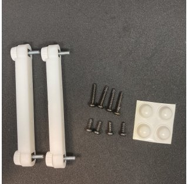  
- ゴム足 　　　　　x 4個
- 専用スペーサー　　 x 2個
- タッピングビス(長)　 x 4個
- タッピングビス(短)　 x 4個  
### 付属品の使い方
直接本体のスロットに挿入する場合は、専用スペーサーをネジ止めして取り付けてください。  
オプションの延長ケーブルを使う場合は基板の裏面にゴム足を貼り付けて使用することも可能です。  
### 専用スペーサについて
固定には、スロットコネクタの左右の穴にタッピングビスを使って固定してください。
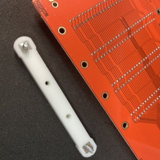
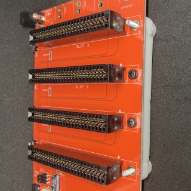

スロットコネクタは入手の都合で2種類あり、固定部があるものと無いものがあります。  
固定部があるものは長いタッピングビスを、無いものは短いタッピングビスを使って固定してください。  
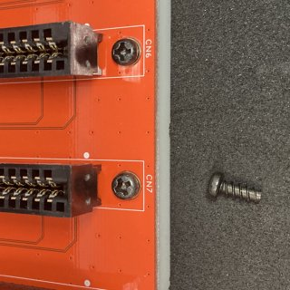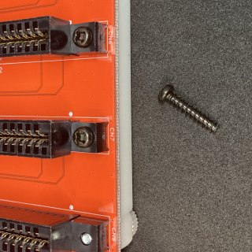  
  
使用時は脚部のネジを回して本体のスロットの高さに本製品を合わせてお使いください。
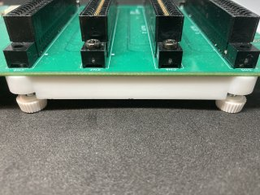

## ■ 使用方法

通常のカートリッジ同様に電源を切ったMSXスロットに挿入してください。  
カートリッジは、正面が下側になるように本基板スロットに挿入してください。

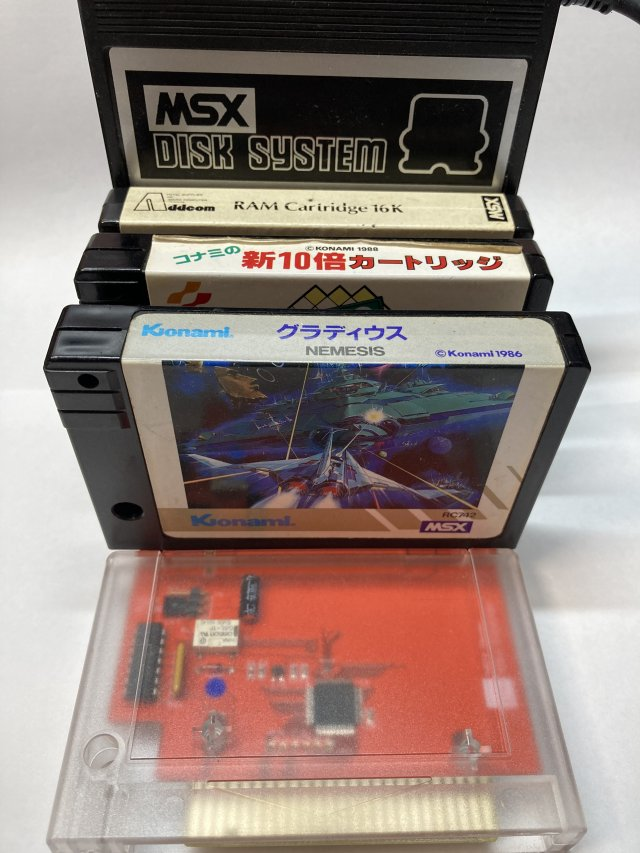  

## ■ メモリマップ

MSXの拡張スロット仕様準拠です。

  
## ■ 頒布基板について
基板上のスイッチおよびジャンパの機能は下記の通りです。  


|Ref No|Name|機能|
| :- |  :- |  :- | 
|S1|SLTSEL(SLOT3)|SLOT3の切り離しスイッチです。<BR>つまみを下にするとカセットを切り離せます|
|S2|SLTSEL(SLOT2)|SLOT2の切り離しスイッチです。<BR>つまみを下にするとカセットを切り離せます|
|S3|SLTSEL(SLOT1)|SLOT1の切り離しスイッチです。<BR>つまみを下にするとカセットを切り離せます|
|S4|SLTSEL(SLOT0)|SLOT0の切り離しスイッチです。<BR>つまみを下にするとカセットを切り離せます|
|J5|POWER SETTING|スロットの5V電源を供給先を選択するジャンパです。<BR>INT側でMSX本体から、EXT側でDCジャックから供給します。|
|CN1 |DCジャック|Φ2.1 5Vセンタープラスのアダプタを接続します。|
|CN2 |SOUNDOUT（SLOT0)|SLOT0のサウンド出力です(オプション)|
|CN4 |SOUNDOUT（SLOT1)|SLOT1のサウンド出力です(オプション)|
|CN9 |SOUNDOUT（SLOT2)|SLOT2のサウンド出力です(オプション)|
|CN10 |SOUNDOUT（SLOT3)|SLOT3のサウンド出力です(オプション)|

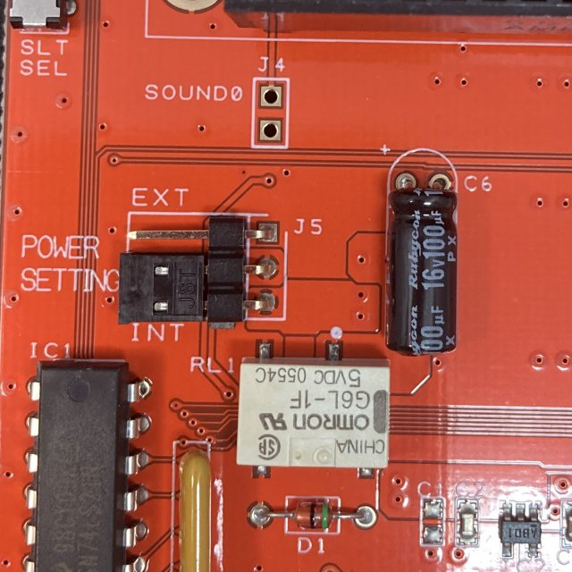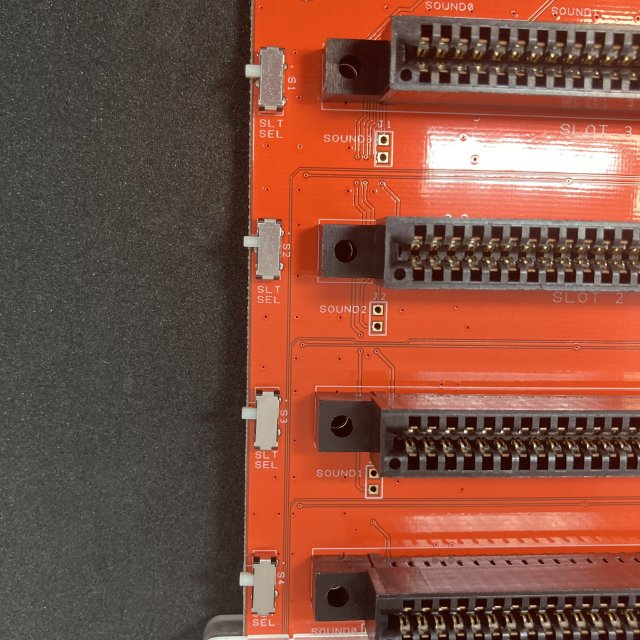

回路図およびガーバファイルが必要な場合はPCBのフォルダーを参考にしてください。  
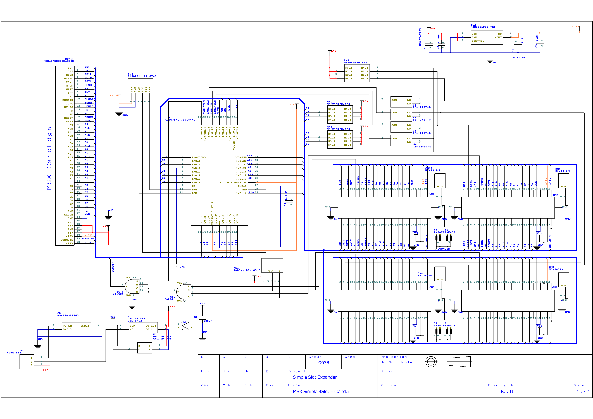

## ■ 外部電源供給について  
本製品はジャンパJ5を切り替えることでスロットの5V電源を外部供給に切り替えることが可能です。  
アダプタは、DCジャックは外径5.5mm内径2.1mm 電圧5V 500mA以上のアダプタを使用してください。  

下記の商品が使用できます。  

秋月電子　超小型スイッチングＡＣアダプター５Ｖ１Ａ  
https://akizukidenshi.com/catalog/g/gM-06096/

COMON DC-5521A + USB ACアダプタ   
http://www.comon.co.jp/DC-5521A.htm

## ■ サウンド出力について  
本製品はサウンドミキシング回路を搭載していません。SOUND IN端子は、4スロット間で直結しています。  
そのためサウンド出力を使うカートリッジを複数のスロットに挿さない様にしてください。
最悪の場合カートリッジを壊す可能性があります。

使用する場合はサウンド出力を使って、外部に接続したミキサーで音源を合成してください。  

### サウンド出力の使い方
DC入力近辺に、サウンド出力を追加するパターンを設けています。  
パーツは一般的なRCAジャックが使える様なパターンになっています。  
当該部にRCAジャックを半田付けしてください。  
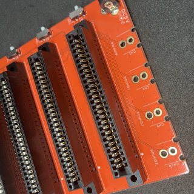

推奨パーツ: 秋月電子　基板用ＲＣＡジャック（黒）  
https://akizukidenshi.com/catalog/g/gC-06509/

使用する場合は、J1-4 SOUNDジャンパの裏面パターンをカットしてください。  
裏面にジャンパを追加することで切り替え式にすることも可能です。(注意：表面だとカセットと接触します）  
なお、SLOT0のSOUNDジャンパ(J4)はシェルケールと干渉するので、そのまま使うのをおすすめします。  
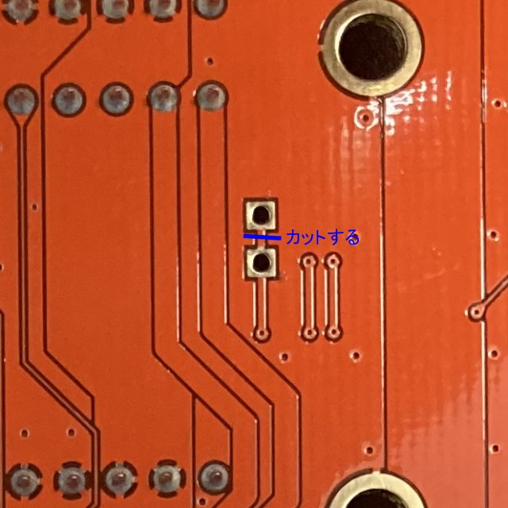

### なぜミキシング回路をつけないのですか？
MSX本体の音声入力は規格で-5dbmと決められています。  
単純に4スロットの音声を全てミキシングしてしまうと出力は4倍になり規格違反になります。  
それを防ぐ為には、各スロットの音声を1/4する必要があるのですが、1つしか音声が入力を接続しないケースでは  
直接スロットに差すときと比較すると音声が非常に小さくなります。  
そこら辺の整合がとれないため、ミキシング回路は省略しています。

なお、市販されていたNEOS EX-4でもミキシング回路は入っておらず直結でした。

## ■ CPLDについて

CPLD Xillix XC9536XLの設計データはRTLのフォルダーを参照してください。  

## ■ (オプション)　MSXスロット延長ケーブル について
MSXのスロットを延長するケーブルです。(ケーブル長20cm)  
スロットに対する物理的な加重や構造的に無理がある場合にお使いください。  
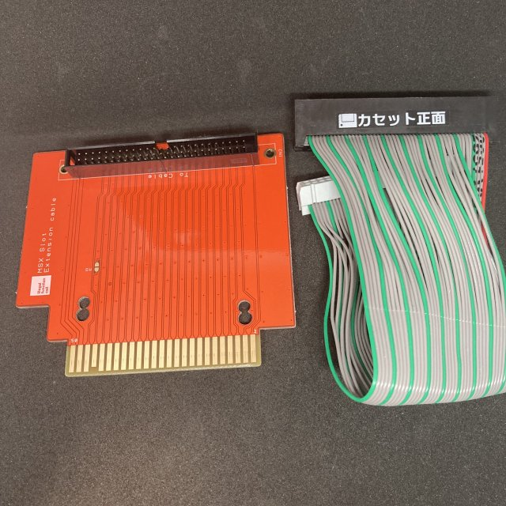  

なお本製品で使用しているカードエッジコネクタは大手メーカ製が廃盤になってしまっており、   
中国製のものを使用しています。そのため金メッキ品ですが長期信頼性は不明です。  
カートリッジシェルは本製品と同じものが使用できます。

使用時はコネクタに張ってある、シール側がカセット正面になるようにセットしてください。
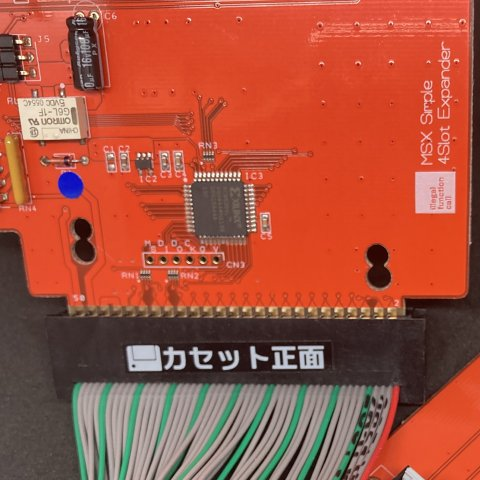  

## ■ (オプション)カートリッジシェル について
シェルケースは
RGRさんのTransparent Cartridge Shell for MSX Konami-styleを切削加工したものを使用しています。  
<https://retrogamerestore.com/store/msx_cart_shell/>  

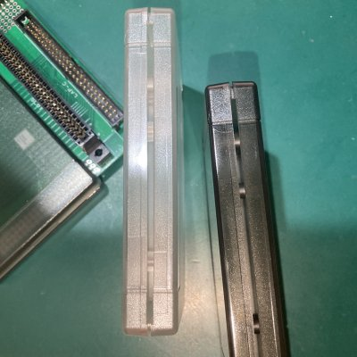  

当方でも加工済みシェルを用意しており、委託先で購入が可能です。  
輸入と加工の都合で若干の小傷がある場合があります。あらかじめご了承ください。  

切削加工部分については、下記図面を参照ください。（ハッチ部分が切削箇所）

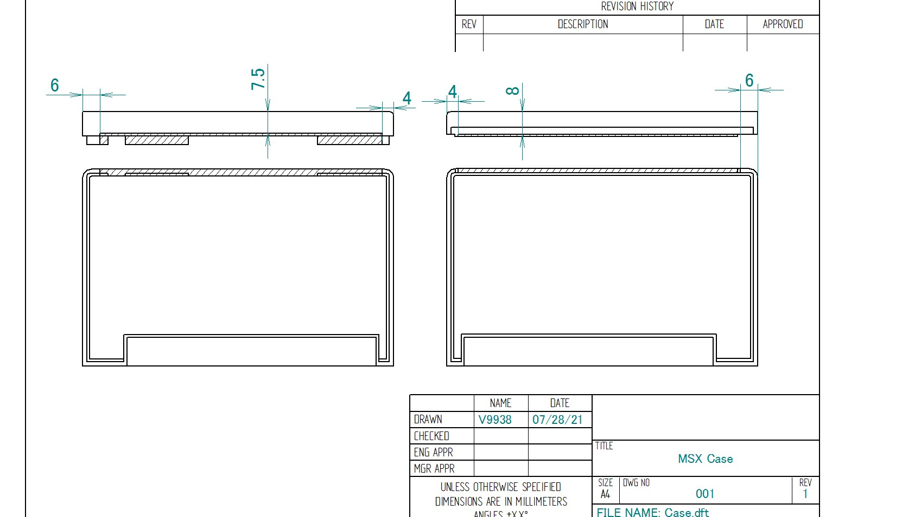  
